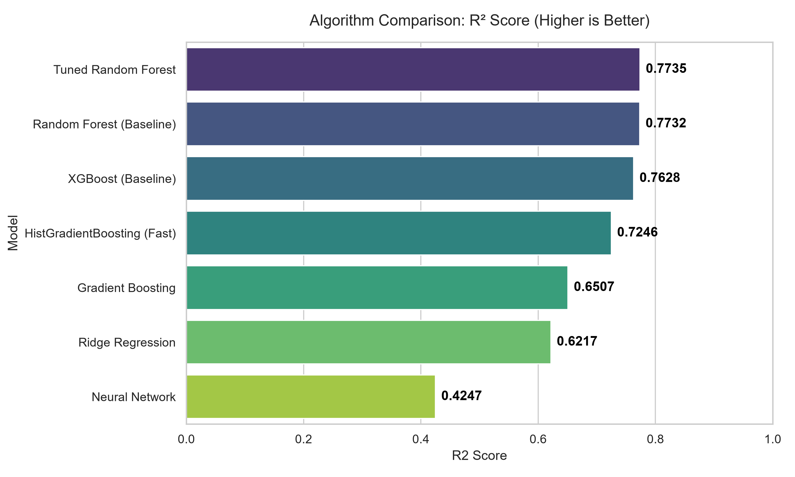
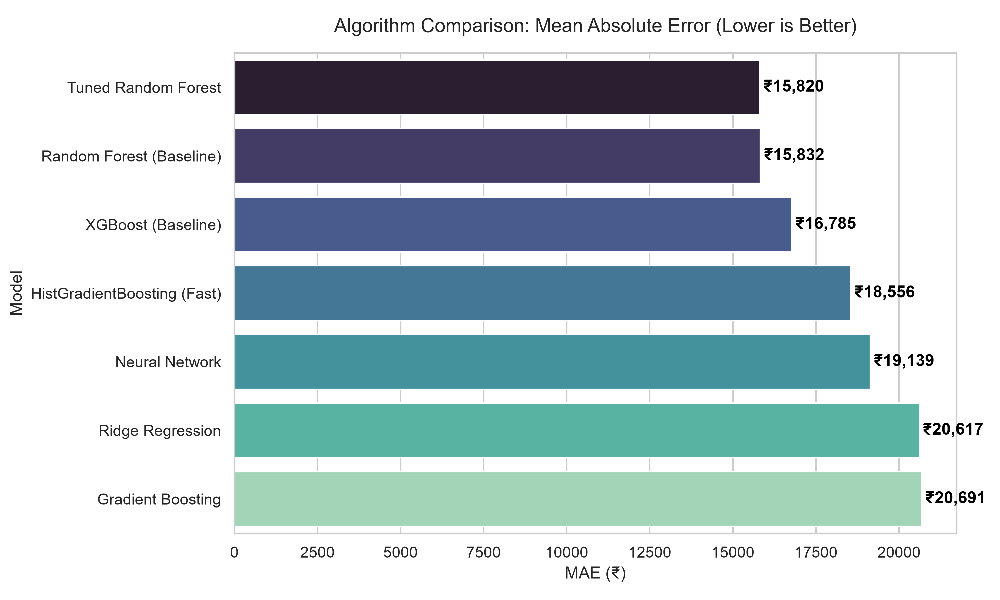

# 🔍 LaptopLens — AI Laptop Price Intelligence

> Know the fair price **before** you buy.

An AI-powered platform that predicts a fair laptop price, finds matching real-time listings, and tracks price history across Indian e-commerce platforms.

## Features

| Feature | Description |
|---|---|
| 🤖 **AI Price Prediction** | XGBoost model trained on 900+ laptops, predicts ±MAE accuracy |
| 🎚️ **Adjustable Tolerance** | You control the ±₹ confidence band (tight/flexible) |
| 📦 **Recommendation Cards** | Matching laptops with spec match scores |
| 🛒 **Dynamic Buying Links** | Instantly redirects to live Flipkart search results to avoid dead links |
| 🏷️ **Use-Case Filter** | Gaming / Office / Design / Programming / General |
| 📝 **Mock → Live** | Demo works offline; live Flipkart scraper is optional |

## Tech Stack

- **Frontend**: React 18 + Vite + Tailwind CSS
- **Backend**: Flask 3 + Gunicorn
- **ML Model**: Random Forest + scikit-learn Pipeline
- **Scraping**: Playwright (optional) + mock data fallback
- **Deployment**: Hugging Face Spaces (Docker)

## Algorithm Comparison

To ensure the highest accuracy for price predictions, we trained and evaluated multiple machine learning algorithms on our curated dataset of ~6,000 real-world laptop listings. 

The models were evaluated using 5-Fold Cross Validation. **Random Forest** consistently outperformed the others, achieving the highest R² score (variance explained) and the lowest Mean Absolute Error (MAE).

### Phase 1: Baseline Models
Evaluated on the raw scraped dataset (6,000+ rows).

- **Random Forest**: R² = 0.665 | MAE = ₹19,397
- **XGBoost**: R² = 0.624 | MAE = ₹21,560
- **Gradient Boosting**: R² = 0.519 | MAE = ₹25,705
- **Ridge Regression**: R² = 0.494 | MAE = ₹24,478
- **Neural Network (MLP)**: R² = -12.027 | MAE = ₹27,781 *(Performed worse than random baseline on this tabular dataset)*


*Figure 1: Baseline R² Score Comparison (Includes Neural Network negative outlier).*

### Phase 2: Post-Improvements 🏆 (Current Implementation)

To improve real-world accuracy, we applied the following improvements:
1. **Aggressive Data Cleaning**: Removed ~800 extreme price outliers using the Interquartile Range (IQR) method.
2. **Hyperparameter Tuning**: Used `RandomizedSearchCV` with 5-Fold Cross Validation.
3. **Advanced Gradient Boosting**: Swapped to Scikit-Learn's highly optimized `HistGradientBoostingRegressor` (similar architecture to LightGBM/CatBoost).

This drastically reduced our Mean Absolute Error (MAE) by over ₹6,000!

- **Tuned Random Forest**: R² = 0.644 | MAE = ₹13,255 🏆 *(Best overall)*
- **Tuned XGBoost**: R² = 0.591 | MAE = ₹14,997
- **HistGradientBoosting**: R² = 0.577 | MAE = ₹15,115


*Figure 2: Post-Improvements R² Score Comparison.*


*Figure 3: Post-Improvements Mean Absolute Error Comparison (Lower is better).*

## Local Development

### Backend (Flask)

```bash
# 1. Create and activate virtual environment
python -m venv venv
venv\Scripts\activate  # Windows
# source venv/bin/activate  # Linux/Mac

# 2. Install dependencies
pip install -r requirements.txt

# 3. Train the model (first time only)
python train_model.py

# 4. Start Flask
python app.py
# → http://localhost:5000
```

By default, `train_model.py` uses the curated `data.csv`. Scraped `data_real.csv` is kept for recommendations because marketplace-title parsing can be noisy. To experiment with scraped training data, run `python train_model.py --data-source real`.

### Frontend (React)

```bash
cd frontend
npm install
npm run dev
# → http://localhost:5173  (proxies /api to Flask:5000)
```

### Build for Production

```bash
cd frontend
npm run build
# Output: frontend/dist/
# Flask will serve this automatically
```

## Docker (local)

```bash
docker build -t laptoplens .
docker run -p 7860:7860 laptoplens
# → http://localhost:7860
```

## Deployment Notes

- `render.yaml` uses the Dockerfile so the React build and Flask backend are built together.
- Runtime files such as `price_history.db*`, `frontend/dist/`, and `scraper/image_cache.json` are generated locally and ignored by Git.
- Set `CORS_ORIGINS` only when the API must be called from a separate frontend origin. Same-origin production deployments do not need it.

## Deploy to Hugging Face Spaces

1. Create a new Space → **Docker** SDK
2. Push this repository:
   ```bash
   git remote add hf https://huggingface.co/spaces/YOUR_USERNAME/laptoplens
   git push hf main
   ```
3. HF Spaces will auto-build and deploy (~5 min first time)

## Split Frontend/Backend Deployment

If the Flask backend is deployed on Hugging Face Spaces and the React frontend is
deployed separately on Vercel, configure both sides with their public origins:

- In Vercel, set `VITE_API_BASE_URL` to your Hugging Face Space URL, for example
  `https://YOUR_USERNAME-YOUR_SPACE_NAME.hf.space`.
- In Hugging Face Spaces, set `CORS_ORIGINS` to your Vercel app URL, for example
  `https://your-app.vercel.app`.

Without `VITE_API_BASE_URL`, the Vercel build calls `/api/...` on the Vercel
domain. Without `CORS_ORIGINS`, the browser blocks calls from Vercel to Hugging
Face.

## Project Structure

```
laptop-price-prediction/
├── app.py                 # Flask API
├── train_model.py         # XGBoost training
├── data.csv               # Training dataset
├── requirements.txt
├── Dockerfile             # Multi-stage build
├── database/
│   ├── db.py              # SQLite CRUD
│   └── schema.sql
├── scraper/
│   ├── cache.py           # TTL in-memory cache
│   ├── mock_data.py       # Demo data generator
│   └── flipkart_scraper.py # Playwright scraper (optional)
├── model/                 # Trained model artifacts
└── frontend/              # React app
    ├── src/
    │   ├── App.jsx
    │   ├── components/
    │   └── api/client.js
    ├── package.json
    └── vite.config.js
```

## Scraping Disclaimer

> Live scraping from Flipkart/Amazon may violate their Terms of Service.
> The Playwright scraper is included for educational purposes.
> For production, use the [Flipkart Affiliate API](https://affiliate.flipkart.com/) (free).

## License

MIT — Personal project, not for commercial redistribution of scraped data.
